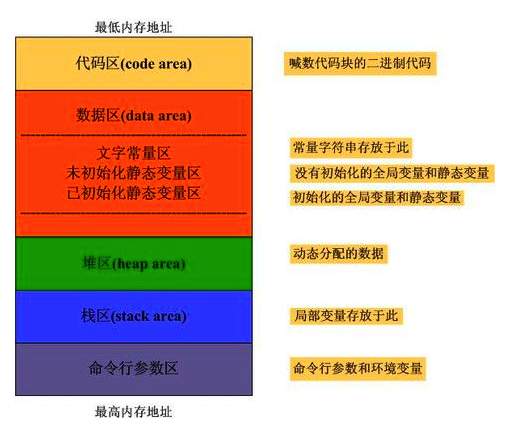

# 
程序员的自我修养  
 
## 
-------------链接,装载与库

***

# 你将学到什么?
- Windows/Linux操作系统下可执行文件和目标文件格式;
- 普通C/C++代码如何被编译成目标文件及程序在目标文件中如何存储;
- 目标文件如何被链接器链接到一起,并且形成可执行文件;
- 目标文件在链接时符号处理,重定位和地址分配如何进行;
- 可执行文件如何被装载并且执行;
- 可执行文件与进程的虚拟空间之间如何映射;
- 什么是动态链接,为什么要进行动态链接;
- Windows/Linux如何进行动态链接及动态链接时的相关问题;
- 什么是堆,栈;
- 函数调用惯例;
- 其他

***

# 需要具备基础知识
- C/C++ 编程语言的基本了解;
- x86汇编语言基础;
- 操作系统基本概念及基础编程技巧和计算机系统结构的基本概念;
- 手动狗头

***
C语言内存分布图:

# 组织架构

分为四个部分,分别如下

## 一 简介
### 第1章 温故而知新
基本的背景知识,包括硬件,操作系统,线程等

***

## 二 静态链接
### 第2章 编译和链接
编译和链接的基本概念和步骤

### 第3章 目标文件里有什么 
介绍COFF目标文件格式和源代码编译后如何在目标文件中存储

### 第4章 静态链接 
介绍静态链接与静态链接的过程和步骤

### 第5章 Windows PE/COFF 
介绍Windows平台的目标文件和可执行文件格式

***

## 三 装载与动态链接

### 第6章 可执行文件的装载与进程
介绍进程的概念,进程的地址空间分布,和可执行文件映射装载过程

### 第七章 动态链接
以 Linux 下 .so 共享库为基础详细分析动态链接的过程

### 第八章 Linux 共享库的组织
介绍Linux下 共享库文件的分布和组织

### 第九章 Windows下的动态链接
介绍 Windows 系统下 DLL 动态链接机制

***

## 四 库与运行库

### 第10章 内存
主要介绍堆与栈,堆的分配算法, 函数调用栈分布

### 第11章 运行库
主要介绍运行库的概念, C/C++运行库, Glibc 和 MSVC CRT, 运行库如何实现C++全局构造和析构以及fread()库函数为例对运行库进行剖析.

### 系统调用与API
主要介绍Windows和Linux的系统调用及Windows的API.

### 运行库的实现
略

[程序员自我修养读书笔记](https://www.jianshu.com/p/31108b62f81d)

