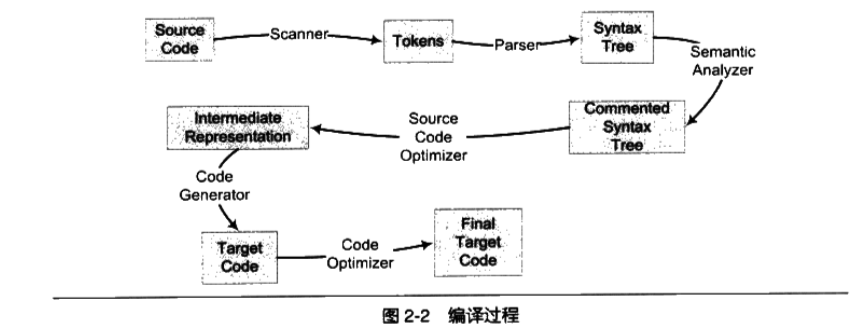
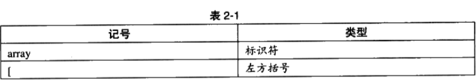
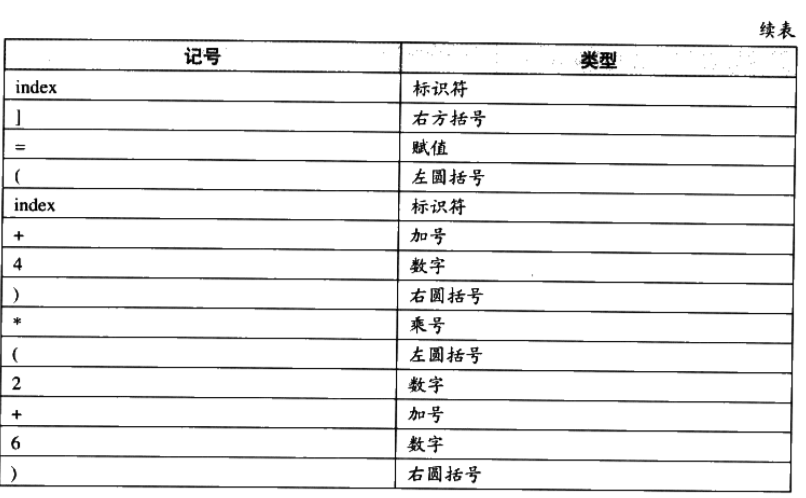
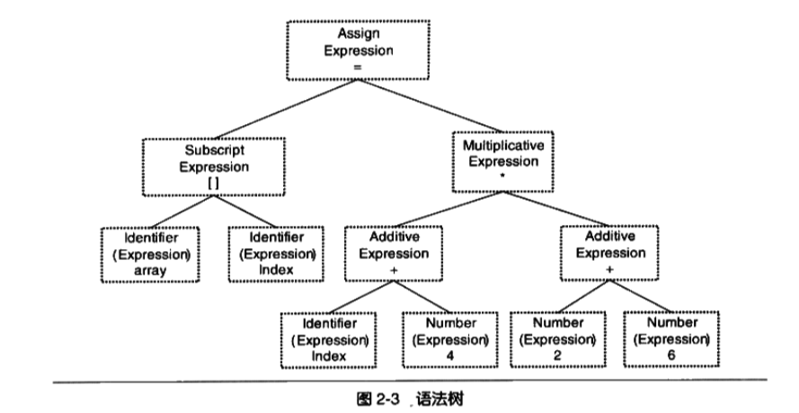
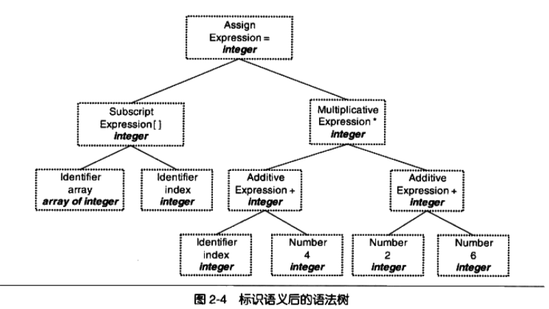
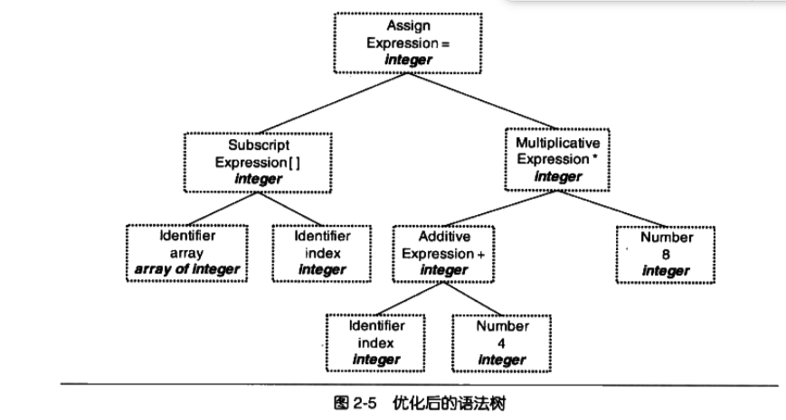
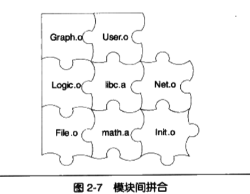

# <center>编译和链接</center> 

___开发环境(IDE)___将编译和链接合并到一起的过程 称为___构建(Build)___.

## 2.1 被隐藏了的过程

Linux下, 编译 只需一行命令 ```$ gcc hello.c```

事实上上述过程分为四个步骤, 分别是___预处理(Prepressing)___, ___编译(Compilation)___, ___汇编(Assembly)___ 和 ___链接(Linking)___.

如图:


### 2.1.1 预编译

将hello.c源文件及相关的头文件被预编译器cpp编译成一个.i文件

第一步预编译的过程相当于如下命令(-E表示只进行预编译操作):

```
$gcc -E hello.c -o hello.i
```

Or

```
$cpp hello.c > hello.i
```

主要处理规则如下:

- 将所有的"#define"删除,并展开所有的宏定义
- 处理所有的条件预编译指令, 比如 "#if", "#ifdef", "#elif", "#else", "#endif".
- 处理"#define"预编译指令, 将包含的文件插入到该预编译指令的位置. 这个过程是递归进行的.
- 删除所有的注释"//", "/**/".
- 添加行号和文件标识, 以便于编译时,编译器产生调试用的行号信息及用于编译时产生的编译错误或者警告时能显示行号.
- 保留所有的#pragma编译器指令, 因为编译器要使用它.

### 2.1.2 编译

把预处理的文件进行一系列词法分析,语法分析,语义分析及优化后生成相应的汇编代码文件, 是整个程序构建的核心部分,这也是最复杂的部分之一.

编译过程相当于执行了如下命令:

```
$gcc -S hello.i -o hello.s
```

或者可以用 cll程序完成预编译和编译这两个步骤:

```
$/usr/lib/gcc/i486-linux-gnu/4.1/ccl hello.c
```

对于c语言代码来说,这个预编译和编译的程序是ccl, 对于OC是cclobj, 所以__gcc命令只是后台程序的包装,他会根据不同的参数要求去调用 预编译编译程序ccl, 汇编器as,  连接器ld.___

### 2.1.3 汇编

汇编器就是将汇编代码转成机器可以执行的命令, 相对于编译器比较简单 根据汇编指令和机器指令的对照表一一翻译就好了.

汇编过程可以调用 as 汇编器来完成:

```
$ as hello.s -o hello.o
```

或者:

```
$gcc -c hello.s -o hello.o
```

或者:

```
$gcc -c hello.c -o hello.s
```

### 2.1.4 链接

链接通常比较费解,为何汇编不直接输出可执行文件,而是输出一个目标文件? 链接过程到底包含了什么内容?为什么要链接?  这涉及到了编译,链接和库,甚至是操作系统一些比较底层的东西. 在搞清楚这些之前, 先看一下编译具体做了哪些内容.

## 2.2 编译器做了什么

直观上讲,编译器就是将高级语言翻译成机器语言的工具.

编译过程一般分为6步: 扫描,语法分析,语义分析,源代码优化,代码生成和目标代码优化.

如图:



结合图, 简单描述从___源代码(Source Code)___到___目标文件(Final Target Code)___的过程.

比如:

```
array[index] = (index + 4) * (2 + 6)
CompileExpress.c
```

### 2.2.1 词法分析

源代码程序被输入到___扫描器(Scanner)___, 扫描器运用一种类似于一种 ___有限状态机(Finite State Machine)___的算法将源码字符序列分割为一系列的___记号(Token)___.

如图:





词法分析产生的记号一般分为以下几类:关键字,标识符,字面量(数字,字符串),特殊符号(+,-). 扫描的同时, 扫描器会将 标识符存放到符号表, 数字字符串常量存放到文字表, 以备分析使用.

lex的程序可以实现词法扫描.

### 2.2.2 语法分析

___语法分析器(Grammar Parser)___对扫描器产生的记号进行语法分析, 从而产生___语法树(Syntax Tree)___. 整个过程采用了___上下文无关语法(Context-free Grammar)___的分析手段. [参考:上下文无关语法及分析](http://pandolia.net/tinyc/ch9_context_free_grammar.html). 由语法分析器生成的语法树就是以___表达式(Expression)___为节点的树.

如图:


整个语句被看做是一个赋值表达式, 左边为一个数组表达式, 右边为是一个乘法表达式. 如果出现了表达式不合法, 编译器就会报语法分析阶段的错误.

正如词法分析 有lex一样, 一个语法分析工具叫 yacc(Yet Another Compiler Compiler). 可以根据用户给定的语法规则对输入的记号序列进行解析. 对于不同的变成语言, 用户只需改变语法规则. 所以它被称为(编译器的编译器).

### 2.2.3 语义分析

___语义分析器(Semantic Analyzer)来完成. 语法分析器仅仅是完成了对表达式词法层面的分析, 它不了解这个语句是否真正有意义. 比如c语言里对两个指针做乘法运算是没有意义的, 但这个语句在语法上是合法的.

编译器能分析的语义是___静态语义(Static Sematic), 也就是编译期就能确定的语义.  与之对应的语义是___动态语义(Dynamic Sematic)___, 只有在运行时才能确定的语义.

静态语义包括:

- 类型的匹配
- 类型的转换

经过语义分析阶段, 语法树表达式被标识了类型, 如果这些类型需要做隐式转换, 语义分析程序会在语法树中插入相应的转换节点.

如图:



每个表达式都被标识了类型, 语义分析器还对符号表里的符号做了分析

# 2.2.4 中间语言的产生

编译器会做很多层次的优化, 这里描述的是___源码级的优化(Source Code Optimizer)___

(2 + 6) 这个表达式, 值在编译时就可以确定, 所以可以被优化.

如图:



其实在语法树上优化比较困难, 所以源代码优化器会将语法树, 转成___中间代码(Intermediate Code)___, 已经接近目标代码了,区别是跟机器和运行时环境是无关的, 比如不包含数据的尺寸,变量地址和寄存器的名称等.

中间代码有很多类型, 比较常见的有:

- ___三地址码(Three-Address Code)___
- ___P-代码(P-code)___

拿 三地址码 举个例子.

```
x = y op z;
op 可以是任何用于 y 和 z 的操作.
```

把上面的例子翻译成 三地址码 是这样的:

```
t1 = 2 + 6;
t2 = index + 4;
t3 = t1 * t2;
array[index] = t3;
```

优化后:

```
t2 = index + 4;
t3 = t2 * 8;
array[index] = t3;
```

中间代码使得编译器分为 前端和后端, 前者负责产生与机器无关的中间代码, 后者将中间代码转换成目标机器代码.   这样对于一些跨平台的编译器, 可以针对不同的平台使用同一个前端编译器和多个后端编译器.

# 2.2.5 目标代码生成与优化

接下来的过程 属于编译器后端.  编译器后端主要包括 : ___代码生成器(Code Genetator)___ 和 ___目标代码优化器(Target Code Optimizer)___.

代码生成器将中间代码生成机器代码, 这个过程十分依赖目标机器(因为不同的机器有着不同的字长,寄存器,整数数据类型,浮点数据类型).

上面例子 代码生成器可能会生成下面的序列代码(x86汇编):

```
movl index , %ecx ; //Value  of index to ecx
addl $4,  %ecx ; // ecx = ecx + 4
mull $8, %ecx ; //ecx = ecx * 8
movl index , %eax ; // value of index to eax
movl %ecx, array(, eax, 4); //array[index] = ecx
```

最后目标代码优化器对上述目标代码进行优化, 比如 选择合适的寻址方式, 使用位移来代替乘法运算,删除多余的指令等. 上面的例子,乘法由一条相对复杂的___基址比例变址寻址(Base Index Scal Adressing)___的lea指令来完成.

```
movl index %edx
leal 32(, %edx, 8), %eax
movl %eax, array(, %edx, 4)

```

其实编译有着异常复杂的结构, 计算机CPU也相当复杂. 经过一系列操作, 源码终于被编译成目标代码. 但是有一个问题: ___index array 地址还没有确定___  index 和 array地址从哪里获取?  如果index在同一个编译单元里, 编译器还可以为其分配地址空间, 倘若他们定义在其他程序模块呢? 

事实上, 定义在其他模块的的全局变量和函数在最终运行时额绝对地址都要在最终链接的时候才能确定. 所以编译器将源码编译成一个未链接的目标文件, 最后由链接器将这些目标文件链接起来形成可执行文件.

## 2.3 链接器的年龄比编译器长

讲讲历史

```
很久以前, 人们编写程序时, 所有源代码都是写在一个文件里, 发展到最后, 
一个文件的代码达到数百万行, 以至于人们无力维护这些代码. 人们开始寻找新的方法, 
一场新的软件开发的革命即将爆发...... 
手动狗头.
```

简单回顾一下计算机程序开发历史:

(1) 最开始,程序员人工的将程序写到存储设备上, 纸带打孔.

但程序一写好并不是一层不变的, 一旦修改,程序员需要重新人工计算修改每个子程序或跳转的目标地址.

重新计算各个目标的地址过程被叫做___重定位(Relocation)___.

这种重新计算所有地址的问题在程序拥有多条纸带(多个模块)的时候更加严重.

(2) 于是先驱发明了汇编语言, 用符号和标记来帮助记忆, 使用符号来标记位置.汇编器在每次汇编程序的时候都会重新计算和修正相应的符号地址. 

 ___符号(Symbol)___:可能是一段子程序(后来发展为函数)的地址, 也可能是一个变量的起始地址.

汇编解放了生产力,  但代码膨胀速度越来越快.  

(3) 便于阅读和重复使用,人们将代码按照功能或者性质划分形成一个个模块.这些模块之间相互依赖又相互独立.

模块之间如何组成一个单一的程序的问题, 可以归结为模块之间如何通信的问题.  也就是模块间函数调用(函数地址)和变量访问(变量地址). 归根结底,就是符号引用的问题.

模块的拼接过程:___链接(Linking)___



## 模块拼装----静态链接

链接的主要工作就是将各个模块之间相互引用的的部分处理好,使之能够正确的衔接. 这和"测好难过许愿人工调整地址"没什么区别.

链接的主要过程包括了: ___地址和空间分配(Address And Storage Allocation),符号决议(Symbol resolution), 重定位(Relocation)___等这些步骤

```
符号决议, 又被称为, 符号绑定 名称绑定 名称决议 地址绑定 指令绑定等,  
而决议更倾向于静态链接, 绑定更倾向于动态链接, 所以这里称之为 决议.

```

静态链接的过程: 每个模块的源文件(eg.c) 文件经过编译之后生成目标文件(eg.o or eg.obj), 目标文件和___库(Library)___一起链接形成可执行文件.  最常见的库就是___运行库(Runtime Libarary)___, 他是支持函数运行的基本函数的集合, 本质上就是常用代码编译目标文件后的打包存放.

比如: 

程序模块 main.c 使用 func.c的 foo() 函数,  main.c模块中每一处使用foo()函数的地方, 都需要知道foo()函数的位置.

但是每个模块都是单独编译的, 编译时, foo()函数的位置对于main.c模块是未知的.所以它暂时将 该目标地址搁置.待到链接时,由链接器将这些指令的目标地址进行修正.

这就是静态链接的最基本的过程和作用.

对于使用其他定义在其他目标文件中的变量来说, 道理也基本一样.

这种地址修正的过程就是___重定位(Relocation)___, 每个被修正的地方叫做___重定位入口(Relocation Entry)___.


