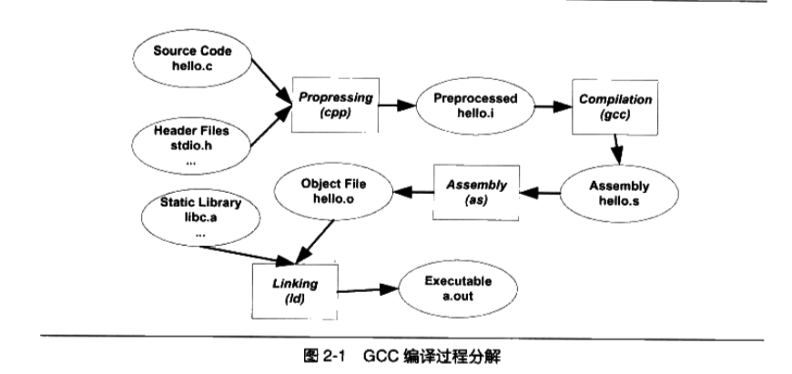

# <center>编译和链接</center> 

___开发环境(IDE)___将编译和链接合并到一起的过程 称为___构建(Build)___.

## 2.1 被隐藏了的过程

Linux下, 编译 只需一行命令 $ gcc hello.c

事实上上述过程分为四个步骤, 分别是___预处理(Prepressing)___, ___编译(Compilation)___, ___汇编(Assembly)___ 和 ___链接(Linking)___.

如图:



### 2.1.1 预编译

将hello.c源文件及相关的头文件被预编译器cpp编译成一个.i文件

第一步预编译的过程相当于如下命令(-E表示只进行预编译操作):

$gcc -E hello.c -o hello.i

Or

$cpp hello.c > hello.i

主要处理规则如下:

- 将所有的"#define"删除,并展开所有的宏定义
- 处理所有的条件预编译指令, 比如 "#if", "#ifdef", "#elif", "#else", "#endif".
- 处理"#define"预编译指令, 将包含的文件插入到该预编译指令的位置. 这个过程是递归进行的.
- 删除所有的注释"//", "/**/".
- 添加行号和文件标识, 以便于编译时,编译器产生调试用的行号信息及用于编译时产生的编译错误或者警告时能显示行号.
- 保留所有的#pragma编译器指令, 因为编译器要使用它.

### 2.1.2 编译

把预处理的文件进行一系列词法分析,语法分析,语义分析及优化后生成相应的汇编代码文件, 是整个程序构建的核心部分,这也是最复杂的部分之一.

编译过程相当于执行了如下命令:

```
$gcc -S hello.i -o hello.s
```

或者可以用 cll程序完成预编译和编译这两个步骤:

```
$/usr/lib/gcc/i486-linux-gnu/4.1/ccl hello.c
```

对于c语言代码来说,这个预编译和编译的程序是ccl, 对于OC是cclobj, 所以__gcc命令只是后台程序的包装,他会根据不同的参数要求去调用 预编译编译程序ccl, 汇编器as,  连接器ld.___

### 2.1.3 汇编

汇编器就是将汇编代码转成机器可以执行的命令, 相对于编译器比较简单 根据汇编指令和机器指令的对照表一一翻译就好了.

汇编过程可以调用 as 汇编器来完成:

```
$ as hello.s -o hello.o
```

或者:

```
$gcc -c hello.s -o hello.o
```

或者:

```
$gcc -c hello.c -o hello.s
```

### 2.1.4 链接


