# <center>温故而知新</center> 

***

## 1.1 从hello world 说起 

```
#include <stdio.h>

int main(int argc, const char * argv[]) {
    // insert code here...
    printf("Hello, World!\n");
    return 0;
}

```

几个问题

- 程序为什么编译了之后才可以运行
- 编译器把C语言程序转换成可以执行的机器码的过程做了什么?怎么做的?
- 最后编译出来的可执行的文件里是什么?除了机器码还有什么?他们怎么存放的?怎么组织的?
- ```#include <stdio.h>``` 是什么含义? 把 ```stdio.h```包进来意味着什么?C语言库又是什么?他们怎么实现的?
- 不同的编译器和不同的硬件平台以及不同的操作系统最终编译出来的结果一吗?为什么?
- Hello World 程序是怎样运行起来的? 操作系统是怎样装载它的?从哪儿开始执行?到哪儿结束?main函数之前发生了什么?main函数之后发生了什么?应该怎么实现?
- prinf是怎么实现的?它为什么可以有不定数量的参数?为什么它能够在终端上输出字符串?
- Hello World 在程序中运行时,它的内存是什么样子的?

不着急慢慢解决.

***

## 1.2 万变不离其宗

计算机是非常广泛的概念, 本书将计算机定义为最流行最为广泛的PC机,采用兼容X86指令集的32位CPU的个人计算机,各种平台的软硬件千差万别,但本质上基本概念和工作原理都是一样的,只需掌握一种便可举一反三,触类旁通.

撇开其他,计算机的核心: 中央处理器, 内存和I/O控制芯片.

早期计算机, CPU核心频率不高,跟内存一样, CPU和内寸连接在总线(Bus)上. I/O设备, 速度很慢,控制器用来协调.

___早期计算机硬件结构___
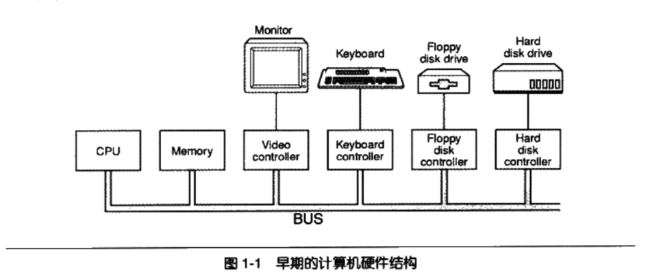

CPU速度提升, 图形化操作系统普及,  CPU与内存大量交换数据,  慢速I/O总线已无法满足需求. 南北桥芯片

___硬件结构框架(PCI/ISA及南北桥设计)___
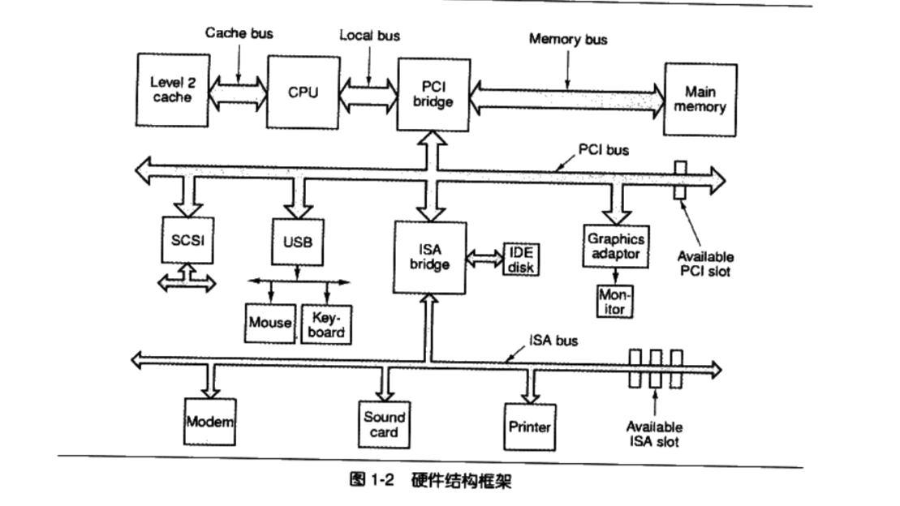

__SPM与多核__

过去几十年 每18个月 CPU频率就翻一倍.  几十kHz至4GHz, 由于制作工艺的物理极限, 04年似乎达到了极限. 没有了质的飞越.

__SMP__

```Symmetrical Multi-Processing``` __对称多处理器__

```
简单来讲,每个CPU所处的地位与发挥的功能都是一样的,是相互对称的.
```

理想情况下, 速度的提高与CPU数量成正比,但是程序并不能分解成若干个完全不相干的子问题.

```
一个女人10个月能生一个孩子, 十个女人不能一个月生一个孩子.
```

多处理器也比较常见, 例如 需要大量计算的, 大型数据库和网络服务

__多核__

个人电脑,多处理器是比较奢侈的行为.

```
厂商考虑将多个处理器"合并在一起打包出售", 这些处理器之间共享比较昂贵的缓存部件,只保留多个核心,
并且以一个处理器的外包装进行出售,售价比单核心得处理器只贵了一点,这就是多核处理器的基本想法
```

可以这么认为:```多核```实际上是```SMP```的简化版.


对于程序员来讲, 除非把处理器的每一滴油水都榨干, 否则可以把```多核```和```SMP```看成同一个概念.

***

## 1.3 站的高,看的远

<table>
    <tr>
        <td colspan="3" align="center">软件</td>
    </tr>
    <tr>
        <td align="center">平台性的</td>
        <td align="center">用于程序开发的</td>
        <td align="center">普通的应用程序</td>            
    </tr>
    <tr>
        <td align="center">操作系统<br>驱动程序<br>运行库<br>数以千计的系统工具</td>
        <td align="center">编译器<br>汇编器<br>链接器<br>等开发工具和开发库</td>
        <td align="center">略</td>
    </tr>
</table>

引用无从考证的一句话:

```
计算机科学领域的任何一个问题都可以通过增加一个间接层来解决
```

计算机软件体系结构:

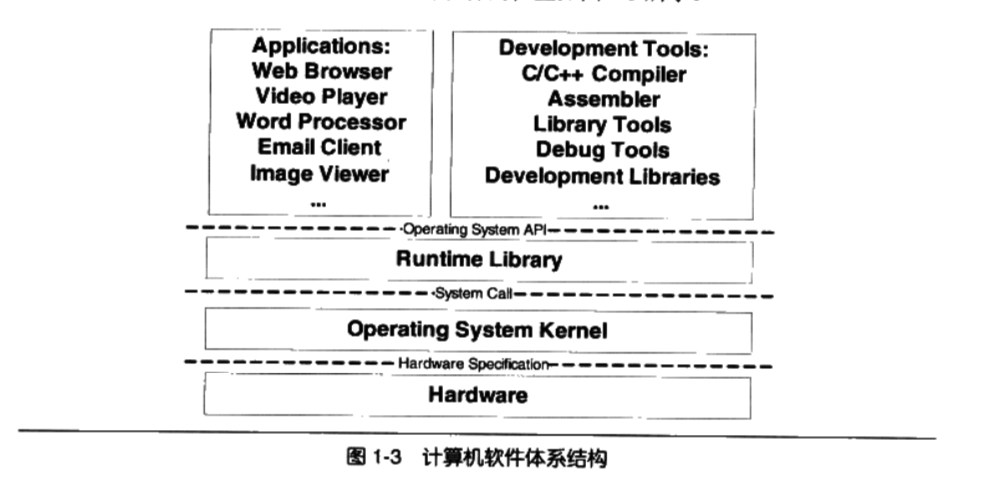

本文着重介绍 连接器和库(包括运行库和开发库)等香瓜内容
***
## 1.4操作系统做什么?

<table>
    <tr>
        <td colspan="2" align="center">操作系统功能</td>
    </tr>
    <tr>
        <td align="center">提供抽象的接口</td>
        <td align="center">管理硬件资源</td>    
    </tr>
</table>

计算机硬件能力有限, 计算机主要资源: CPU 存储器(包括内存和磁盘)和I/O设备, 分别从这三个方面来看看如何挖掘他们的潜力.

### 1.4.1 不要让CPU打盹

 早期: ___多道程序(MutiProgramming)___:某个程序无法使用CPU时,监控程序把另外正在等待CPU资源的程序启动,是的CPU能够充分的利用起来.

缺点: 不分轻重缓急, 紧急的需要使用CPU资源的应用程序可能要等待很久才有机会分配到CPU

```
Windows 上点击鼠标 十分钟后系统才响应, 是多么令人沮丧的一件事.
```

改进1: ___分时系统(Time-Sharing System)

每个程序运行一段时间后,主动让出CPU给其他应用程序,使得每段时间每个程序都有机会运行一小段时间,这对于一些交互式任务尤其重要. 完整的操作系统雏形已经逐渐形成
缺点:如果一个程序进行一个很耗时的计算, 一直霸占着CPU不放, 操作系统也没有办法,其他系统就只有等着,整个系统就像死机了一样. 当然当时PC硬件处理能力本身就弱, 其上的应用大多比较低端,所以分时方式可以勉强应付一下交互式环境.

``` 例如 while(1) ```

改进2:___多任务系统(Muti-tasking)___

操作系统接管了所有的硬件资源,并且本身运行在一个受硬件保护的级别,所有的应用程序都以进程(Process)的方式运行在比操作系统权限更低的级别.每个进程都有自己独立的地址空间,使得进程之间的地址空间相互隔离.CPU由操作系统进行统一分配,每个进程根据进程优先级的高低都有机会得到CPU,但是如果进程运行超过一定时间,操作系统就会暂停该进程.这种CPU的分配方式称为___抢占式(Preemptive)___,操作系统可以强制剥夺CPU资源并且分配给它认为最需要的进程.


如果操作系统分配给每个进程的时间都很短,即CPU在多个进城之间快速切换,从而造成多个进程同时运行的假象. 目前几乎所有现代的操作系统都是采用这种方式.

### 1.4.2 设备驱动

操作系统作为硬件层的上层,它是对硬件的管理和抽象. 对于操作系统上面的运行库和应用程序来说, 他们希望看到一个统一的硬件访问模式.作为开发者我们不希望在开发应用程序的时候直接读写硬件的接口,处理硬件终端这些繁琐的事情.

```
我们希望在显示器上画一条直线, 我们只需要调用 LineTo() 函数,不管计算机使用什么显卡,显示器,屏幕分辨率.

```

当成熟的操作系统出现以后,硬件逐渐被抽象了一系列概念.

在UNIX中硬件设备的访问与普通文件形式一样. 

在Windows系统中图形硬件被抽象为GDI, 声音和多媒体设备被抽象为DirectX对象,磁盘被抽象为普通文件系统,等等.

繁琐的硬件细节全部交给操作系统, 具体就是硬件驱动(Device Driver)来完成.

驱动程序可以看做是操作系统的一部分,它与操作系统内核一起运行在特权级, 但它又与操作系统之间有一定的独立性,使得驱动程序有着比较好的灵活性.

硬件多如牛毛,驱动程序的开发工作通常由硬件厂商完成,操作系统开发者为硬件生产厂商提供一系列接口和框架, 凡是按照该接口和框架开发的驱动程序均能在该操作系统上使用.

以一个读取文件的例子看一看操作系统和驱动程序在这个过程中扮演何种角色.

先简单介绍文件系统, 其为操作系统中最为重要的组成部分之一, 管理着磁盘中文件的储存方式.

```
关于磁盘结构:
硬盘的结构介绍,硬盘的基本存储单位为扇区(Sector), 每个扇区一般为512个字节. 一个硬盘分多个盘片, 每个盘片分两面,每面按照同心圆划分若干磁道,每个磁道划分为若干个扇区.

比如,一个硬盘有两个盘片, 每个盘面有分65536个磁道, 每个磁道分1024个扇区, 那么硬盘的容量就是 2*2*65536*1024*512字节  = 128GB.

现代磁盘普遍使用一种叫做LBA(Logical Block Adress)的方式, 整个磁盘所有扇区从0开始编号,一直到最后一个扇区,扇区编号叫做逻辑扇区号.
其抛弃了复杂的磁道 盘片的概念, 给出一个逻辑扇区号,电子设备会将其转换为实际的盘面和磁道等这些位置.
```

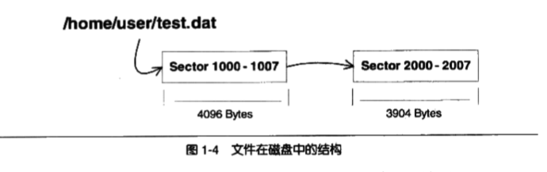

文件系统管理着磁盘中文件的存储方式,保存文件的存储结构,负责维护这些数据结构并保证磁盘中的这些扇区能够有效的组织和利用. Linux 下, 使用 Read的系统来实现, 文件系统收到Read请求之后,判断出文件的逻辑扇区,然后文件系统向硬盘驱动发起逻辑扇区的请求, 磁盘驱动收到这个命令之后,向硬盘发出硬件指令,硬盘接收到命令之后,就会执行相应的操作,并将数据读取到预先设置好的没存地址中. 当然你这个例子只是最简单的情况.


## 1.5 内存不足怎么办?

前面提到,操作系统的多任务功能使得CPU能够在多个进程间共享, 操作系统的I/O抽象模型实现了I/O设备的抽象和共享.那么剩下的也就是内存的分配问题了.

早期计算机,程序直接运行在物理内存上,也就是程序在运行中访问的地址都是物理地址. 如果程序同时只运行一个程序, 只要该程序所需要的内存空间不超过物理内存的大小, 就不会有问题. 但事实上, 为了更好的利用硬件资源, 需要同时运行多个程序. 

那么就会一个明显的问题:__如何将计算机有限的物理内存分配给多个应用程序使用?__

假设:计算机有128M内存, 程序A:10M  程序B: 100M  程序C: 20M

比较直接的做法就是 分配: A:0~10M B:10M~110M , 这样就能使得A和B同时运行. 但这样问题就比较多.

- 地址空间不隔离:所有程序直接访问物理地址, 内存地址不隔离. 恶意软件or臭虫 修改了某个程序的数据, 就会使得其他程序也崩溃. 显然很不稳定,不能容忍.

- 内存使用效率低下: 由于没有有效的内存管理机制, 程序执行时, 监控程序将整个应用程序装入内存中然后开始执行. 如果忽然要运行另外一个应用程序, 而此时内存已经不足, 那么就需要将其哪一个程序的数据暂时写到磁盘里,等到用的时候再读回来. 由于程序所需要的空间是连续的, 就会有大量的数据在导入和导出. 效率低下.

- 程序运行的地址不确定: 程序每次装入运行时, 需要分配足够的内存空间, 这个空闲区域的位置是不确定的, 而编写程序时访问指令和跳转地址都是固定的. 这样涉及到程序的__重定向__问题, 这个后面会提到.

解决以上问题, 有一个法宝, 那就是加一个中间层.   ___虚拟地址___, 然后通过映射将虚拟地址转化为实际的物理地址. 这样只要控制好虚拟内存地址到物理地址的映射过程 就可以达到程序之间访问的物理内存区域不相互重叠.


### 1.5.1 关于空间隔离

两种地址空间:
 - 物理地址空间: 实实在在存在于计算机中, 每台计算机都有唯一一个, 比如32为处理器, 地址线有32条(实际上有36条, I/O设备,暂且认为有32条), 那么物理地址空间就有4GB. 如果只装了512M的内存, 那么有效部分只有 0x00000000 ~ 0x1FFFFFFF, 其他都是无效的.

 - 虚拟地址空间:抽象出来的, 每个进程有自己独立的虚拟地址空间,只能访问自己的地址空间

 这样就有效的做到了地址空间的隔离

### 1.5.2 分段(Segmentation)

最开始使用___分段(Segmentation)___的方法, 基本思路就是把一段所需要内存空间大小的虚拟空间映射到某个地址空间.虚拟空间的每个字节相对于物理空间的每个字节. 

映射过程由软件来设置. 比如操作系统来设置这个映射函数, 实际地址转换由硬件来完成.如图所示:
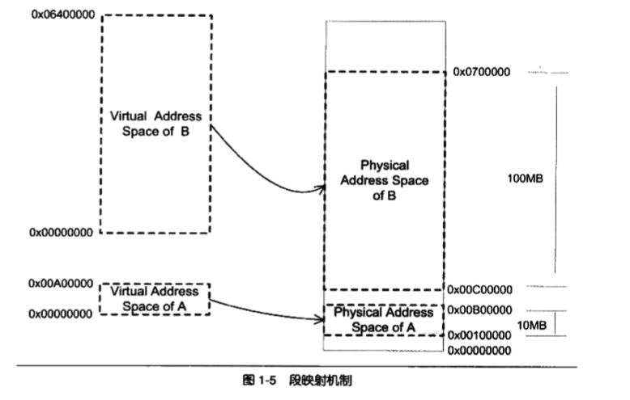

分段解决了第一个和第三个问题:

显然分段做到了地址隔离. 程序访问虚拟空间的地址超出了实际可用的的物理地址空间, 硬件会判断出并将这个问题报告给操作系统或者监控程序.

对于每个程序来说,无论物理地址空间被分配到哪一段,对于程序来说都是透明的,他们不需要关心物理地址的变化.开发者只需要按照虚拟地址空间来编写程序和放置变量,所以程序不需要重定位.

但是显然 分段 的方法并未解决第二个问题, 这种方法很粗糙:

依然以整个程序为粒度来分配地址空间.事实上,根据___程序的局部性原理___, 程序运行的某个时间段,只是频繁的运用到一小部分数据.

人们自然而然的想到用更小的粒度来做内存分割和映射. ___分页(Paging)___应运而生

### 1.5.3 分页(Paging)

分页的基本方法就是把地址空间认为的分为固定大小的页,每一页的大小由硬件决定或者硬件支持多种大小的页,比如4KB或者4MB,但同一时刻只能选择一种大小.  对于整个操作系统来说页是固定大小的.  物理地址空间也是同样的分页大小.

简单的例子:
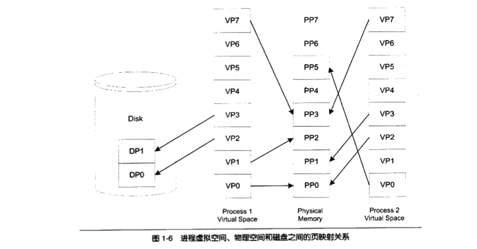

如图,每个虚拟空间有8页,每页大小为1KB, 即虚拟空间大小为8KB. 假设CPU有13条地址线,即其寻址能力为2^13 即最大为8KB,  而假设实际内存大小只有6KB, 即实际有效的物理地址空间为6KB. 

虚拟页(VP, Virtual Page); 物理页(PP, Physical Page); 磁盘页(DP, Disk Page)

进程需要用到 磁盘页的时候, 硬件会捕获___页错误___信息, 报告给操作系统, 操作系统负责将物理页读取并且载入内存. 然后将内存中的这两个页与VP2 VP3建立映射关系.

以页为单位来存取和交换这些数据非常方便, 硬件本身也支持这种方式.

保护也是页映射的目的之一:每个页可以设置权限属性, read or readWrite, 只有操作系统有权限修改这些属性, 操作系统便可以保护自己和进程.  后面会详细提到.

虚拟存储的实现需要硬件支持, 不同的CPU不同. 但几乎所有的硬件都是用一个叫做 MMU(Memory Management Unit)部件来进行页映射. 一般MMU都集成在CPU内部了,不会以独立的部件存在.

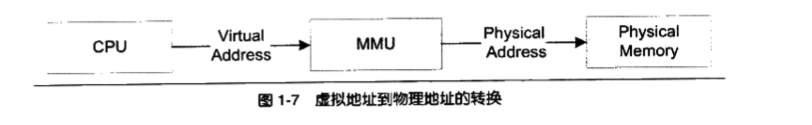


## 1.6 众人拾材火焰高

### 1.6.1 线程基础

CPU频率增长停滞, 加上多核的发展. 多线程方法地位渐显. 回顾一下, 线程的概念, 线程调度,线程安全,用户线程与内核线程之间的映射关系. 线程虽不是本书重点,但对于对理解装载,动态链接,特别是运行库有很大帮助.

#### 什么是线程

__线程(Thread)__,有时被称为__轻量级进程(Lightweight Process, LWP)__,是程序执行流的最小单元. 

一个标准的线程由线程ID,当前指令指针(PC),寄存器集合和堆栈组成.

通常意义上, 一个进程由多个线程组成, 各个线程之间共享程序的内存空间(代码段,数据段,堆等)及一些进程级的资源(如打开文件和信号).
如图: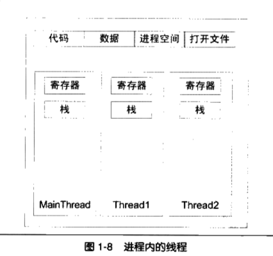

通常情况下,使用多线程原因有以下几点:

- 有效利用等待时间.如网络响应等
- 多线程可以让一个线程用于计算, 一个线程用于交互. 
- 并发操作, 比如一个多端下载软件
- 更全面发挥CPU能力
- 相对于多进程, 数据共享效率更高.

#### 线程的访问权限

线程 私有存储空间:
- 栈(尽管并非完全无法访问,也可以认为私有的)
- 线程局部存储(TLS, Thread Local Storage), 操作系统为其单独提供的私有空间, 但容量有限
- 寄存器(包括PC寄存器), 寄存器为执行流的基本数据, 为线程私有.

如图, C语言的角度来看线程

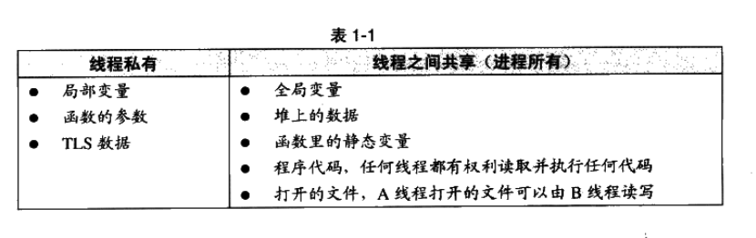

#### 线程调度与优先级

当 线程数量>处理器数量, 就会有线程调度问题. 

不断的在同一处理器切换不停线程的行为称之为___线程调度(Thread Schedule)___

线程通常拥有三种状态:
- 运行(Running) :正在执行
- 就绪(Ready): 可以立即运行,但CPU被占用
- 等待(Waiting): 正在等待某一事件发生,无法执行

处于运行中线程拥有一段可以执行的时间,这段时间称为___时间片(Time Slice)___

如图 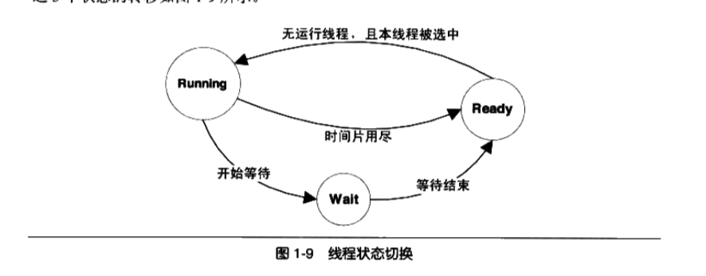

主流线程调度方式各有不同 但都有 ___优先级调度(Priority Schedule)___ 和 ___轮转法(Round Robin) 的痕迹, 顾名思义即可.

Linux下, 可调用 pthread库 来实现线程相关操作.

一般把频繁进入等待的线程称之为___IO密集型线程(IO Bound Thread)____, 把很少进入等待的线程称之为___CPU密集型线程(CPU Bound Thread)____,通常情况下IO 比 CPU更容易得到优先级的提升.

线程___饿死(Starvation)___现象: CPU密集型线程获得较高优先级时, 一些较低优先级线程会无法执行.  为避免饿死现象,调度系统会逐步提升等待过长时间而得不到执行的线程的优先级.

线程优先级改变一般有三种方式:

- 用户指定优先级.
- 根据进入等待状态的频繁程度提升或者降低优先级.
- 长时间得不到执行而被提升优先级.

#### 可抢占线程和不可抢占线程

线程在用尽时间片之后会被强制剥夺继续执行的权利,而进入就绪状态,这个过程叫做___抢占(Preemption)___. 早期的线程是不可抢占的.

在不可抢占线程中,县城主动放弃有两种情况:
- 当前线程试图等待某事件(如I/O);
- 线程主动放弃时间片;

非抢占式线程有个特点:线程调度时机是确定的, 避免抢占式线程, 调度时机不确定而产生的问题(线程安全, 后面会提到). 即使如此, 非抢占式线程也很少见.


#### Linux的多线程

Windows 对线程和进程的实现如同教科书一般的标准, Linux对多线程的支持颇为贫乏.

实际上Linux 不存在实际意义的线程概念.Linux所有的执行实体(无论是线程还是进程)都称为___任务(Task)____, 每一个任务概念上类似一个单线程的进程, 具有内存空间,执行实体,文件资源等. 不同的任务之间可以选择共享内存空间, 实际意义上, 共享同一个内存空间的多个任务构成了一个进程, 这些任务也就是进程中的线程.

可以用以下方法创建一个新的任务:

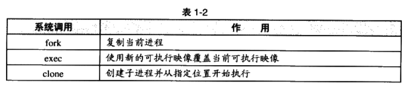

fork 产生本任务的镜像,生成新的任务,exec配合启动别的新任务以执行新的可执行文件, clone产生新的线程.

一个概念: 两个任务同时自由读取内存,任意一个任务试图对内存进行修改时,内存就会复制一份提供给修改方单独使用, 以免影响到其他任务的使用. 这就是所谓的___写时复制(Copy on Whrite, COW)___

如图
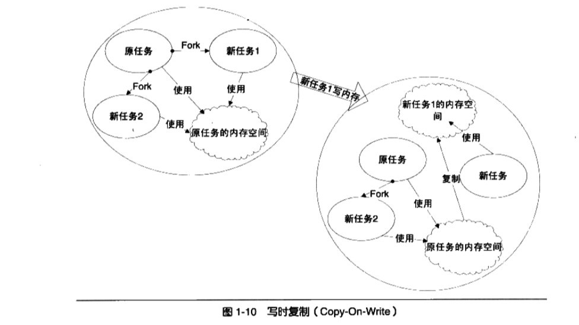


### 1.6.2 线程安全

多线程在并发时, 数据的一致性尤为重要

#### 竞争与原子操作

单指令的操作称为___原子的(Atomic)___, 无论如何单指令的操作不会被打断.

 简单场合下原子操作指令非常方便, 复杂情况下保证一个复杂的数据结构更改的原子性, 原子操作就力不从心. 需要使用更加通用的手段: 锁.

 ### 同步与锁

所谓 ___同步(Synchronization)___ 一个线程访问数据未结束的时候, 其他线程不得对同一数据进行访问.  如此数据访问被原子化.

同步最常见的方法就是___锁(Lock)___, 一种非强制机制,每个线程在访问数据或者资源时, 首先视图___获取(Acquire)___锁,并且在结束访问之后___释放(Release)___锁. 在锁被占用的时候, 试图获取锁, 线程会等待,直到锁重新可用.

几种锁:


____二元信号量(Binary Semaphore)___, 最简单的锁  两种状态:占用与非占用.   适用于被唯一一个线程独占访问的资源.

对于允许多个线程并发访问的资源,多元信号量简称___信号量(Semaphore)___.

初始值为N, 允许N个线程并发访问.

线程访问资源, 首先获取信号量,进行如下操作:

- 将信号量值 减 1
- 如果值小于0, 则进入等待状态, 否则进入等待状态, 否则继续执行

访问资源后,线程释放信号量, 然后进行如下操作

- 将信号量的值加1
- 如果信号量的值小于1, 则唤醒一个等待中的线程.

___互斥量(Mutex)___:资源仅同时允许一个线程访问, 与二元信号量类似, 但有一个区别: 二元信号量可以由一个线程获取之后,由另外一个线程释放; 而互斥量只能由同一个线程获取和释放. 由一个线程获取, 另外一个线程释放互斥量是无效的.

___临界区(Critical Section)___: 比互斥量更加严格.  互斥量和信号量在系统的任何进程都是可见的.  而临界区的作用范围仅限于本进程, 其他进程无法获取该锁. 除此以外,临界区具有与互斥量相同的性质.

___读写锁(Read-Write Lock)___: 更加特定场合的同步.  数据操作.  读写锁两种获取方式 ___共享的(Shared)___或___独占的(Exclusive)___. 其行为可以总结如下:

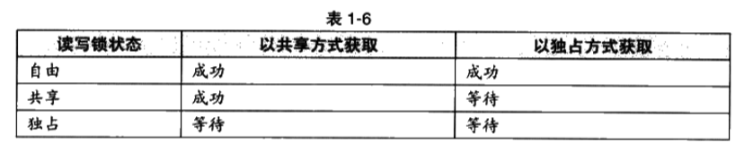

___条件变量(Condition Variable)___: 类似于一个栅栏, 顾名思义, 让许多线程一起等待某个事件的发生,当事件发生时(条件变量被唤醒), 所有的线程一起恢复执行.

### 可重入(Reentrant)与线程安全
一个函数被重入, 表示这个函数没有执行完成, 由于外部因素或者自身原因,又一次进入该函数执行. 有两种情况会发生重入:
- 多线程同时执行这个函数.
- 函数自身调用自身.

一个函数被称为可重入的,说明一个函数被重入之后,不会产生任何不良情况. 具备以下条件:

- 不使用任何静态或者全局的非Const变量;
- 不返回任何静态或者全局的非Const变量指针;
- 仅依赖于调用方提供的参数;
- 不依赖于任何单个资源的锁;
- 不调用任何不可重入的函数;

一个可重入函数可以在多线程环境下放心使用.

### 过度优化

- 虽然有锁的保护, 编译器为了提高变量的访问速度, 把变量放到了某个寄存器里, 不同线程的寄存器是各自独立的, 因此可能会有不好的结果发生.

例如:

 x = 0; 

 Thread1: lock(); x++; unlock();

 Thread2: lock(); x++; unlock();

 两个线程执行完之后, x结果还有可能是1;


 - 早几十年前,CPU就发展出了动态调度. 在执行程序的时候,为了提高执行效率有可能交换指令的顺序. 编译器在进行优化的时候,也有可能为了效率为交换毫不相干的两条指令.  

 例如:

 x = y = 0;

 Thread1: x = 1; r1 = y;

 Thread2: y = 1; r2 = x;

 交换之后可能是这样的:

 x = y = 0;

 Thread1: r1 = y; x = 1;

 Thread2: y = 1; r2 = x;

 那么 r1 = r2 = 0就完全有可能了.

 ___Volatile___关键字试图阻止过度优化, 做两件事:

 - 阻止编译器为了提高速度而将变量放入寄存器而不写回;
 - 阻止编译器调整操作volatile变量的指针顺序;

显然Volatile 可以完美解决第一个问题, 但不能解决第二个问题, 因为Volatile没法阻止CPU动态调度换序.


### 1.6.3 多线程内部情况(简单了解)

[Linux内核线程kernel thread详解](https://blog.csdn.net/gatieme/article/details/51589205)

#### 三种线程模型

线程的并发执行是有多处理器或者操作系统调度来实现的. 内核线程由多处理器或者调度来实现并发(这里的内核线程和Linux里的knernel_thread并不是一回事), 但用户实际使用的线程并不是内核线程,而是存在于用户态的用户线程.

#### 1.一对一模型

优点:用户线程具有与内核线程一致的优点,线程之间的并发是真正的并发.

缺点:内核线程数量有限,导致用户线程数量受限;内核线程上下文切换开销大;

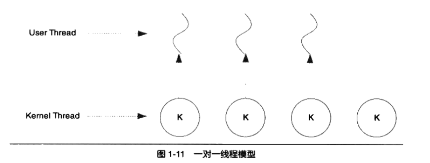


#### 2.一对多线程模型

优点:线程切换由用户态代码进行, 线程切换速度快. 几乎无限制的线程数量
缺点:其中一个用户线程阻塞所有用户线程均无法执行. 因为相应的内核线程也阻塞了.

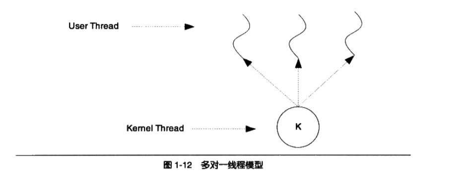

#### 3.多对多线程模型

结合了前两者的特点.
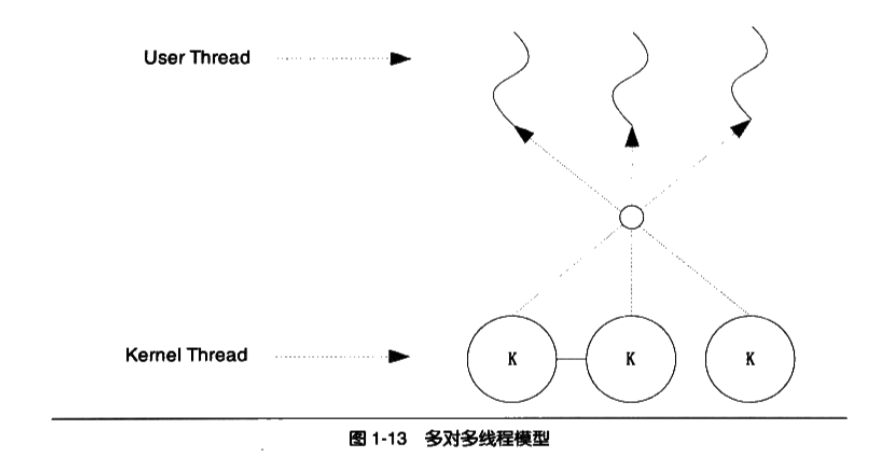


